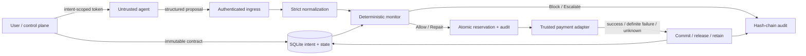

# Architecture and threat model

## Trusted boundaries

Trusted: user-approved structured contract, control credential, server clock, monitor process, DB integrity, adapter and wallet signer (a future integration). Untrusted: agent reasoning, prompt, tool output, proposed intent ID, amount, recipient, resource, reference and free text. Authentication resolves the bound intent independently of the supplied ID.

MVP assumes the agent cannot bypass this process to access a wallet or alternate payment tool. The product does not make that isolation true by itself. Deployers must put wallet credentials and the execution adapter outside the agent's writable context. Control-key compromise, DB administrator compromise, malicious authorized merchants, wrong user contracts, credential exfiltration and compromised adapters are outside the enforcement guarantee.

Purpose is explanatory metadata. Resource and recipient membership enforce structured scope; the kernel does not prove that a resource actually serves that purpose. Natural-language-to-contract translation is not implemented, intentionally avoiding silent inference of authority.

## Money and normalization

One accounting unit: sandbox USDC at 6 decimals, integer micro-units. A single amount is limited to 1,000,000 USDC so arithmetic remains safely representable. Unknown fields, floats, scientific notation, excess precision, empty identifiers and zero/negative values are rejected. There is no currency conversion.

EVM-shaped addresses are lowercased; HTTPS URL identifiers are parsed with WHATWG URL serialization and reject credentials/fragments. Otherwise identifiers use a restrictive ASCII grammar. There is no broad URL prefix matching, fuzzy matching, automatic alias discovery, or inference from text. Query ordering remains significant. User input must match the same canonical form on contract and proposal.

No caller timestamp can set the evaluation clock. Validity windows are UTC with explicit `Z`. Frequency uses an inclusive `[now-window, now]` interval of reserved, unknown and successful requests. This is intentionally conservative; delayed settlement does not shift the original authorization time. The host must have a trustworthy clock; the current prototype does not persist a monotonic high-water mark across host clock rollback.

## Policy and state

`evaluate` returns an executable action only for Allow/Repair. It first gathers hard constraints, then escalation, then repair/allow. Amount clipping is permitted only for resources explicitly listed in `repairResources`. Budget/count/frequency/replay are rechecked on the candidate amount. Clipping does not substitute recipients/resources or modify fixed-price semantics on its own. `escalateAbove` can require new authority even below the per-payment cap. Escalation creates no approval credential: the user must issue a new immutable intent.

Reserved and unknown payments count toward every capacity check, preventing concurrent requests from reusing funds or slots. A fingerprint hashes the original canonical action; a stronger invoice key hashes `(intentId, recipient, reference)` to prevent changed-amount or changed-resource replay. Successful and pending invoice keys are unique in the DB; definitive failures release them for retry. Changing the reference defeats duplicate matching, as it would with an untrusted invoice ID; trusted invoices are future work.

## Execution is a saga, not a distributed atomic commit

1. `BEGIN IMMEDIATE`: read intent/state, evaluate, insert reservation, append audit record, commit.
2. Invoke the trusted adapter using the reserved action and **transaction ID as idempotency key**.
3. `BEGIN IMMEDIATE`: record receipt, commit success or mark definitive failure, audit, commit.
4. If response is lost, malformed, timed out or throws, retain `unknown`. Reconcile only against adapter receipts.

`BEGIN IMMEDIATE` serializes writers across SQLite connections on the same host. No JS mutex is the source of correctness. The sandbox external-effects ledger is durable and keyed uniquely by transaction ID. Unit tests use independent worker threads with separate connections to exercise contention.

The external payment and local state update cannot be made one transaction by this design. A crash after step 1 leaves a reservation, possibly before submission; a crash after settlement leaves a reservation despite a completed payment. Receipt lookup resolves known results. **Missing lookup results are not failures**. No automatic reservation TTL releases uncertain funds. A production adapter needs authenticated settlement evidence, durable outbox/recovery, receipt verification, cancellation semantics and an operational reconciliation queue. The current sandbox lookup is immediate; remote lookup deadlines would need handling in a real adapter.

Revocation stops future reservations. It does not reverse payments already reserved or externally submitted. Validity is checked at reservation time; already authorized operations may settle after the window ends. A production contract/adapter must explicitly define submission and settlement expiry semantics. A response status `succeeded` refers to the sandbox adapter's receipt, never blockchain finality.

## Audit

Contract creation/revocation, successfully parsed authenticated proposals (including normalization failures) and execution/reconciliation outcomes are logged. Authentication failures, invalid HTTP JSON, body-limit rejection and low-level transport failures do not currently appear in the hash chain; use proxy/access logs for those. A failure to persist a proposal audit rolls back its reservation before invoking the adapter.

`h[i] = SHA256(h[i-1] || canonicalJSON(record[i]))`. The exported head must be retained outside the writable DB for meaningful tamper evidence. Local verification alone cannot detect a completely rewritten chain or removal of a valid suffix. This is not a signed, externally anchored, append-only storage system.

## Local operator console

The API requires bearer credentials; no ambient auth cookies. Control keys can create/revoke intents, run experiments, inspect logs and use console payments. Agent grants are hashed and bound to exactly one intent. The local demo bootstrap deliberately exposes the temporary control key to a loopback browser; host/origin checks reduce browser cross-origin access and rebinding, but do not defend against another local process. Secure mode requires an operator key and does not expose it in bootstrap. External reverse-proxy authentication and tenant separation are not provided.

The console does not persist an agent token. The operator key in non-demo mode remains in `sessionStorage` for the tab session. The service emits a CSP, denies framing, limits request bodies, validates export names and uses parameterized SQL. These measures are prototype controls, not a security audit or compliance certification.
